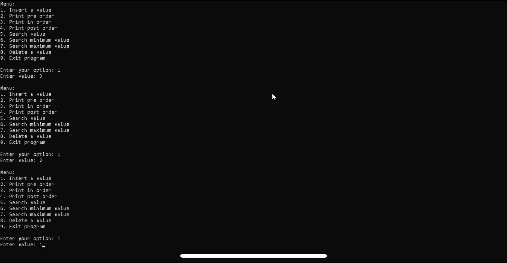

# Binary Search Tree Data Structure

Take a look at my Binary Search Tree (BST) project in C++, featuring efficient operations like insertion, deletion, search, minimum, and maximum value retrieval! 🌳



## Table of Contents
1. [Introduction](#introduction)
2. [Project Overview](#project-overview)
3. [Features](#features)
4. [Installation](#installation)
5. [Live Preview of the Recording](#live-preview-of-the-recording)
6. [File Structure](#file-structure)
7. [Technologies Used](#technologies-used)
8. [Code Explanation](#code-explanation)
9. [Future Improvements](#future-improvements)
10. [Conclusion](#conclusion)

## Introduction
Explore my implementation of the **Binary Search Tree (BST)** in C++! This project demonstrates the key operations of a Binary Search Tree, a data structure that allows for efficient search, insertion, and deletion operations by maintaining a sorted hierarchical structure.

The Binary Search Tree provides efficient data storage and retrieval, supporting operations to insert elements, search for values, delete nodes, and retrieve the minimum and maximum elements in the tree.

## Project Overview
This project includes a C++ implementation of a Binary Search Tree (BST). The tree maintains a sorted structure, where each node has at most two children:
- The left child contains values less than the parent.
- The right child contains values greater than the parent.

This sorted arrangement ensures that the tree supports search, insertion, and deletion operations with a time complexity of O(log n) in a balanced tree.

## Features
- **Insertion**:  
  Adds new elements into the tree in their correct sorted position, maintaining the Binary Search Tree property.
  
- **Deletion**:  
  Removes elements from the tree while maintaining the structure of the Binary Search Tree. Handles cases for nodes with zero, one, or two children.
  
- **In-Order Display**:  
  Displays elements in sorted order by performing an in-order traversal (left subtree, root, right subtree).
  
- **Pre-Order Display**:  
  Displays the tree elements in pre-order traversal (root, left subtree, right subtree).
  
- **Post-Order Display**:  
  Displays the elements in post-order traversal (left subtree, right subtree, root).

- **Minimum Value**:  
  Retrieves and returns the smallest value in the tree, which is located at the leftmost node.
  
- **Maximum Value**:  
  Retrieves and returns the largest value in the tree, located at the rightmost node.

- **Search**:  
  Efficiently searches for a specific value in the tree. If the value exists, the corresponding node is returned; otherwise, it indicates the value was not found.
  
## Installation
To run the **Binary Search Tree Data Structure**, follow these steps:

1. **Download the Source Code**: Clone or download the source files from this repository.

2. **Compile the Code**: Open your terminal or command prompt, navigate to the directory containing the source code, and use the following command to compile:

   ```bash
   g++ Main.cpp -o BinarySearchTree
   ```

3. **Run the Program**: After compiling, you can run the program with:

   ```bash
   ./BinarySearchTree
   ```

## Live Preview of the Recording
Watch a live preview of the Binary Search Tree operations in action!

[Screen Recording](screenRecording.mp4)

> **Note:** The quality of this screen recording has been reduced to comply with GitHub's file size limit.

## File Structure
Here’s a breakdown of the files included in the project:

- [Main.cpp](Main.cpp)  
  Main file where program execution begins. It contains the code to interact with the user and perform operations such as insert, delete, search, and display.
  
- [BinarySearchTree.h](BinarySearchTree.h)  
  Header file containing the definition of the Binary Search Tree class and its functions.
  
- [MyBinarySearchTree.h](MyBinarySearchTree.h)  
  Additional helper functions related to Binary Search Tree operations.
  
- [Node.h](Node.h)  
  Defines the structure of a node in the Binary Search Tree, including pointers to the left and right children and the data stored in the node.

- [README.md](README.md)  
  The file you are currently reading, providing an overview of the project.

- [img.png](img.png)  
  Image used to visualize the Binary Search Tree.

- [screenRecording.mp4](screenRecording.mp4)  
  A screen recording demonstrating the Binary Search Tree operations.

## Technologies Used
- **Languages**: C++
- **Compilers/IDE**: Dev-C++, Visual Studio, Visual Studio Code

## Code Explanation

### **Node Structure**
Each node in the Binary Search Tree contains:
- **Data**: The value stored in the node.
- **Left Child**: Pointer to the left child node, which holds values smaller than the current node.
- **Right Child**: Pointer to the right child node, which holds values greater than the current node.

### **Insertion**
- **Objective**: Insert a new element while preserving the Binary Search Tree properties.
  
  The element is inserted at the appropriate location to maintain the sorted order.

### **Deletion**
- **Objective**: Remove a node from the tree.
  
  The deletion process handles three cases:
  1. **Node has no children**: Simply remove the node.
  2. **Node has one child**: Remove the node and link its parent directly to its child.
  3. **Node has two children**: Replace the node with its in-order successor or predecessor.

### **Traversals**
- **In-Order**: Displays nodes in ascending order.
- **Pre-Order**: Displays nodes starting from the root, followed by the left and right subtrees.
- **Post-Order**: Displays nodes in the order of left subtree, right subtree, then root.

### **Minimum and Maximum Values**
- **Minimum Value**: Found by traversing to the leftmost node of the tree.
- **Maximum Value**: Found by traversing to the rightmost node of the tree.

### **Search Operation**
- **Objective**: Locate a specific element in O(log n) time.
  
  The search starts at the root and moves left or right depending on whether the target value is smaller or larger than the current node.

## Future Improvements
- **Balanced Tree Implementation**:  
  Implement an AVL Tree or Red-Black Tree to ensure the tree remains balanced, improving performance for large datasets.
  
- **Visualization**:  
  Create a graphical interface to visualize the structure of the tree dynamically.

## Conclusion
The Binary Search Tree project demonstrates the implementation of a fundamental data structure that is useful for efficient storage, retrieval, and management of sorted data.
